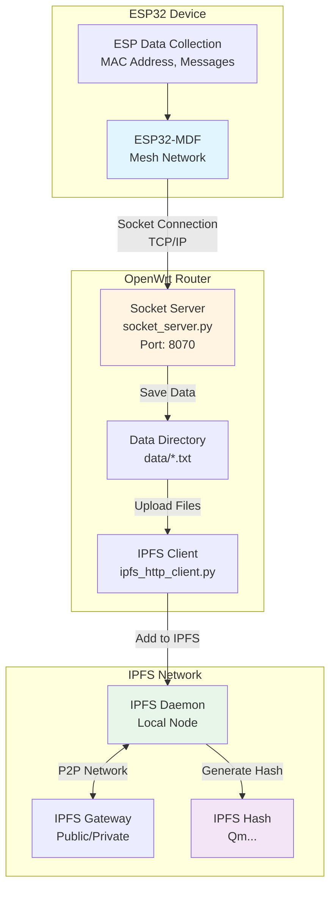
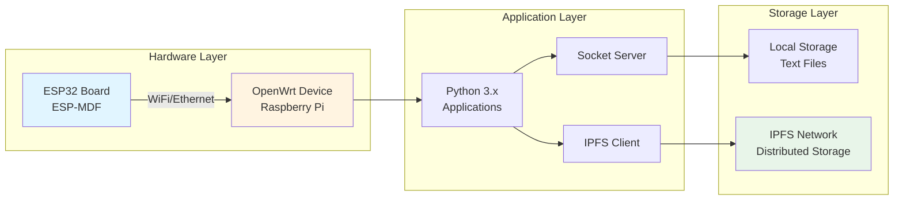

# IoT Projects

> Consolidated repository for IoT and embedded systems projects

## 📋 Overview

This repository consolidates IoT and embedded systems projects, focusing on ESP32, OpenWrt, and related technologies.

## 🏗️ Architecture

### ESP32-OpenWrt Communication Flow



### System Architecture



## 📁 Projects

### [esp32-openwrt](./esp32-openwrt/)

ESP32-MDF (ESP-Mesh) and OpenWrt Socket communication using Python3.

**Features:**
- Socket communication between ESP32 and OpenWrt
- ESP data file gathering
- ESP MAC address data and message display in text files
- IPFS integration for data storage

**Key Components:**
- `socket_server.py` - Socket server for ESP32-OpenWrt communication
- `ipfs_http_client.py` - IPFS HTTP client for data storage

## 🚀 Quick Start

### Prerequisites

- ESP32 development board
- OpenWrt router/device
- Python 3.x
- ESP-MDF toolchain

### Installation

#### ESP32 Setup

```bash
cd ~/esp
git clone --recursive https://github.com/espressif/esp-mdf.git
cd ~/esp/esp-mdf/esp-idf
./install.sh
cd ~/esp/esp-mdf
source export.sh
```

#### OpenWrt Setup

```bash
opkg update
opkg install python3 git python3-pip
git clone -b v1.0 https://github.com/Twodragon0/esp32-openwrt.git
pip3 install ipfshttpclient
```

## 📖 Usage

### Socket Communication

Start the socket server on OpenWrt:

```bash
python3 socket_server.py
```

### IPFS Integration

Start IPFS daemon and upload data:

```bash
ipfs daemon &
python3 ipfs_http_client.py
```

## 📚 Documentation

For detailed documentation, please refer to the individual project README files:
- [esp32-openwrt README](./esp32-openwrt/README.md)

## 🔧 Troubleshooting

### ESP-MDF Toolchain Issues

If you encounter toolchain errors with release v3.2.2, refer to:
- [ESP-MDF Issue #66](https://github.com/espressif/esp-mdf/issues/66)

### OpenWrt USB Storage

For Raspberry Pi USB storage setup in OpenWrt:
- [OpenWrt USB Storage Guide](https://openwrt.org/docs/guide-user/storage/usb-drives)

## 📝 License

Please refer to individual project licenses.

## 👤 Author

**Twodragon**
- GitHub: [@Twodragon0](https://github.com/Twodragon0)
- Blog: [twodragon.tistory.com](https://twodragon.tistory.com)

## 🤝 Contributing

Contributions are welcome! Please feel free to submit a Pull Request.

---

**Last updated:** 2025-12-27
